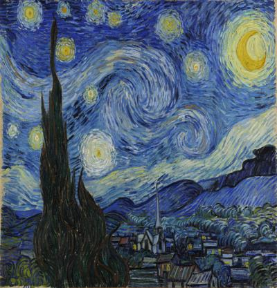

# StyleTransfer-PyTorch
Implementation of image style transfer in PyTorch. 
The paper outlining the transfer method can be found [here](https://www.cv-foundation.org/openaccess/content_cvpr_2016/papers/Gatys_Image_Style_Transfer_CVPR_2016_paper.pdf).

## Setting up the environment
You can install the required pacakages to run this notebook by running:

    pip install -r requirements

This notebook works on both CPU and GPU.

## Using custom images
* Put the images you want to use for style transfer in the **images** folder.
* Change the `content_path` and `style_path` to the respective images you want to use.
* The output images will get exported to the **output** folder.

## Tweaking the model
* Change the `style_weights` to change the effect of each style layer on the output (lower weights for later layers is preferrable).
* The ratio of `content_weight` and `style_weight` determines the trade-off between content and style of the image(lower ratio facilitates high rates of style transfer).

## Sample Output

| Content Image  | Style image | Style transferred image  |
| ------------- | ------------- | ------------- |
|   |   |   |

## Common errors
If you can't run the notebook on your device's GPU manually set the `device` varaible to `cpu`.
